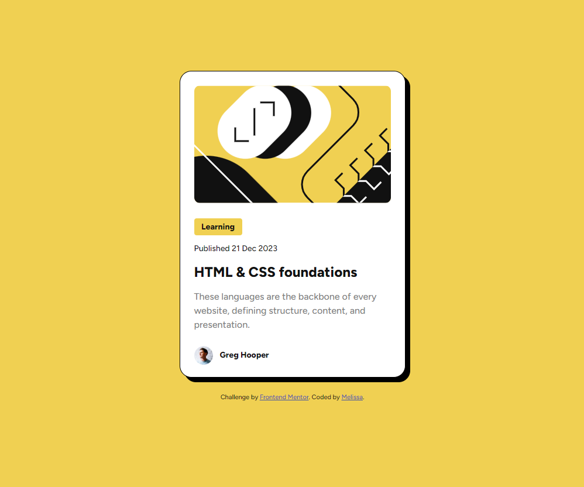

# Frontend Mentor - Blog preview card solution

This is a solution to the [Blog preview card challenge on Frontend Mentor](https://www.frontendmentor.io/challenges/blog-preview-card-ckPaj01IcS).

## Table of contents

- [Overview](#overview)
  - [The challenge](#the-challenge)
  - [Screenshot](#screenshot)
  - [Links](#links)
- [My process](#my-process)
  - [Built with](#built-with)
  - [What I learned](#what-i-learned)
  - [Continued development](#continued-development)
  - [Useful resources](#useful-resources)
- [Author](#author)

## Overview

### The challenge

Users should be able to:

- See hover and focus states for all interactive elements on the page

### Screenshot




### Links

- Solution URL: [https://github.com/MelissaZhuu/blog-preview-card-main](https://github.com/MelissaZhuu/blog-preview-card-main)
- Live Site URL: [https://melissazhuu.github.io/blog-preview-card-main/](https://melissazhuu.github.io/blog-preview-card-main/)

## My process

### Built with

- HTML5
- CSS
- Flexbox
- SASS

### What I learned

I learned how to use SASS, a CSS preprocessor to help style my HTML elements. I used variables to store commonly used values such as the colors in the design file, and created a "Mixin" for the font styling to reduce redundant code. I also learned how to nest pseudoclasses like :hover and easily style the hover effects under the same selector. Addionally, I learned how to use @font-face to use font files in the assets folder as opposed to importing them in the HTML from Google Fonts, which is the method I'm most familiar with.

Below are some of my findings where using SASS really helped clean up my CSS code:

I noticed that the design had 4 colors in the color palette and decided to use SASS variables to store their values so I can easily refer to the specific color when I needed it.
```scss
/*Colors*/
$yellow: #F4D04E;
$black: #111111;
$grey: #7F7F7F;
$white: #FFFFFF;

.label {
    background: $yellow;
}
```

Instead of having multiple .author selectors:
```css
.author img {
    width: 32px;
    height: 32px;
}

.author {
    display: flex;
    align-items: center;
    margin: 0px 24px 24px 24px;
    gap: 12px;
}
```
With SASS, you can nest them:
```scss
.author {
    display: flex;
    align-items: center;
    margin: 0px 24px 24px 24px;
    gap: 12px;

    img {
        width: 32px;
        height: 32px;
    }
}
```

I noticed there were 4 types of font variations used in the final design which would require a lot of repetitive code. I discovered this amazing SASS feature called "mixins" that allow you to write a template that takes in optional arguments that can be customized to each selector. I used variables for these arguments to change the font weight, color and size.
```scss
/*Text fonts*/
@mixin font($weight, $color, $size) {
    font-family: "Figtree", sans-serif;
    font-weight: $weight;
    color: $color;
    line-height: 150%;
    font-size: $size;
}

.learning, .name {
    @include font(800, $black, 14px)
}

.body-text {
    @include font(500, $grey, 16px)
}
```

I also learned that HTML paragraph and heading tags contain default top and bottom margins that were messing up my spacing so I had to remove them at the start:
```css
* {
margin: 0;
padding: 0;
}
```

### Continued development

I would like to continue practicing different skills and tools in the future like using Bootstrap or Tailwind in the next one and maybe moving on to more complex challenges with Javascript.

### Useful resources

- [SASS Documentation](https://sass-lang.com/documentation/)
- Stack Overflow, w3schools, MDN Web Docs, the usual...

## Author

- Website - [GitHub](https://github.com/MelissaZhuu)
- Frontend Mentor - [@MelissaZhuu](https://www.frontendmentor.io/profile/MelissaZhuu)
